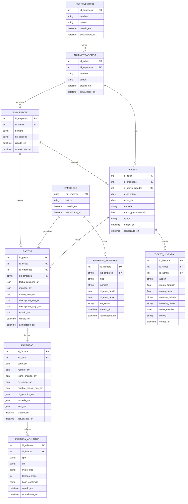

```mermaid
erDiagram
  SUPERVISORES ||--o{ ADMINISTRADORES : dirige
  ADMINISTRADORES ||--o{ EMPLEADOS : supervisa
  ADMINISTRADORES ||--o{ TICKETS : crea
  EMPLEADOS ||--o{ TICKETS : asignado
  TICKETS ||--o{ GASTOS : cubre

  EMPRESAS ||--o{ EMPRESA_NOMBRES : tiene
  EMPRESAS ||--o{ GASTOS : proveedor
  EMPLEADOS ||--o{ GASTOS : realiza
  GASTOS ||--|| FACTURAS : factura
  FACTURAS ||--o{ FACTURA_ADJUNTOS : adjunta
  TICKETS ||--o{ TICKET_HISTORIAL : registra

  SUPERVISORES {
    int id_supervisor PK
    string nombre
    string correo
    datetime creado_en
    datetime actualizado_en
  }

  ADMINISTRADORES {
    int id_admin PK
    int id_supervisor FK
    string nombre
    string correo
    datetime creado_en
    datetime actualizado_en
  }

  EMPLEADOS {
    int id_empleado PK
    int id_admin FK
    string nombre
    string nit_persona
    datetime creado_en
    datetime actualizado_en
  }

  TICKETS {
    int id_ticket PK
    int id_empleado FK
    int id_admin_creador FK
    date fecha_inicio
    date fecha_fin
    string moneda
    float monto_presupuestado
    string estado
    datetime creado_en
    datetime actualizado_en
  }

  TICKET_HISTORIAL {
    int id_historial PK
    int id_ticket FK
    int id_admin FK
    string accion
    float monto_anterior
    float monto_nuevo
    string moneda_anterior
    string moneda_nueva
    date fecha_efectiva
    string motivo
    datetime creado_en
  }

  EMPRESAS {
    string nit_empresa PK
    string activo
    datetime creado_en
    datetime actualizado_en
  }

  EMPRESA_NOMBRES {
    int id_nombre PK
    string nit_empresa FK
    string tipo
    string nombre
    date vigente_desde
    date vigente_hasta
    string es_actual
    datetime creado_en
    datetime actualizado_en
  }

  GASTOS {
    int id_gasto PK
    int id_ticket FK
    int id_empleado FK
    string nit_empresa FK
    json fecha_consumo_arr
    json moneda_arr
    json monto_total_arr
    json descripcion_sug_arr
    json descripcion_pago_arr
    json estado_arr
    datetime creado_en
    datetime actualizado_en
  }

  FACTURAS {
    int id_factura PK
    int id_gasto FK
    json serie_arr
    json numero_arr
    json fecha_emision_arr
    json nit_emisor_arr
    json nombre_emisor_doc_arr
    json nit_receptor_arr
    json moneda_arr
    json total_arr
    datetime creado_en
    datetime actualizado_en
  }

  FACTURA_ADJUNTOS {
    int id_adjunto PK
    int id_factura FK
    string tipo
    string url
    string mime_type
    int tamano_bytes
    string hash_contenido
    datetime creado_en
    datetime actualizado_en
  }


```
