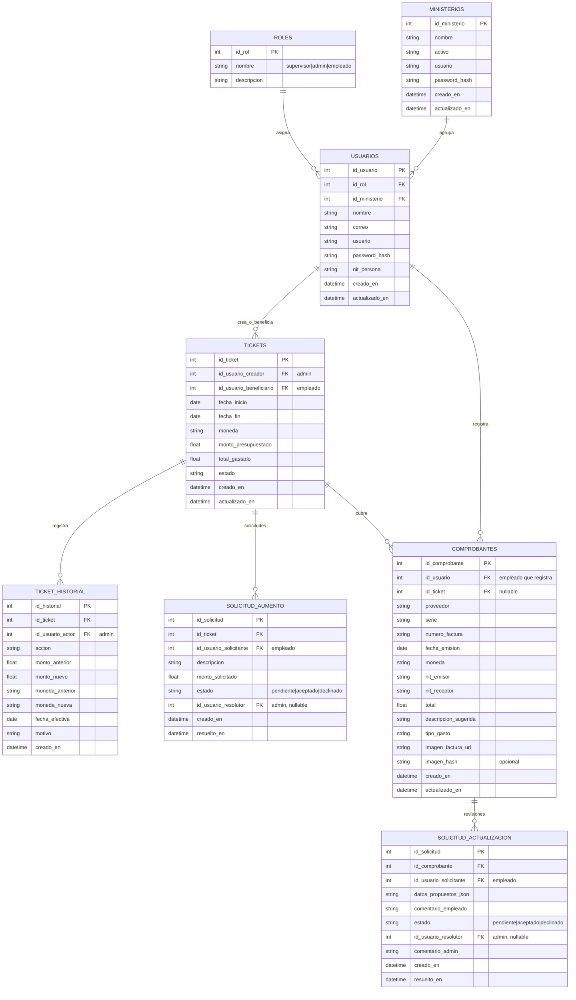

```mermaid
erDiagram
  %% Roles y organización
  ROLES ||--o{ USUARIOS : asigna
  MINISTERIOS ||--o{ USUARIOS : agrupa

  %% Tickets / Presupuesto
  USUARIOS ||--o{ TICKETS : crea_o_beneficia
  TICKETS ||--o{ TICKET_HISTORIAL : registra
  TICKETS ||--o{ SOLICITUD_AUMENTO : solicitudes
  TICKETS ||--o{ COMPROBANTES : cubre

  %% Comprobantes
  USUARIOS ||--o{ COMPROBANTES : registra
  COMPROBANTES ||--o{ SOLICITUD_ACTUALIZACION : revisiones

  %% Tablas
  USUARIOS {
    int id_usuario PK
    int id_rol FK
    int id_ministerio FK
    string nombre
    string correo
    string usuario
    string password_hash
    string nit_persona
    datetime creado_en
    datetime actualizado_en
  }

  ROLES {
    int id_rol PK
    string nombre "supervisor|admin|empleado"
    string descripcion
  }

  MINISTERIOS {
    int id_ministerio PK
    string nombre
    string activo
    string usuario
    string password_hash
    datetime creado_en
    datetime actualizado_en
  }

  TICKETS {
    int id_ticket PK
    int id_usuario_creador FK "admin"
    int id_usuario_beneficiario FK "empleado"
    date fecha_inicio
    date fecha_fin
    string moneda
    float monto_presupuestado
    float total_gastado
    string estado
    datetime creado_en
    datetime actualizado_en
  }

  TICKET_HISTORIAL {
    int id_historial PK
    int id_ticket FK
    int id_usuario_actor FK "admin"
    string accion
    float monto_anterior
    float monto_nuevo
    string moneda_anterior
    string moneda_nueva
    date fecha_efectiva
    string motivo
    datetime creado_en
  }

  COMPROBANTES {
    int id_comprobante PK
    int id_usuario FK "empleado que registra"
    int id_ticket FK "nullable"
    string proveedor
    string serie
    string numero_factura
    date fecha_emision
    string moneda
    string nit_emisor
    string nit_receptor
    float total
    string descripcion_sugerida
    string tipo_gasto
    string imagen_factura_url
    string imagen_hash "opcional"
    datetime creado_en
    datetime actualizado_en
  }

  SOLICITUD_AUMENTO {
    int id_solicitud PK
    int id_ticket FK
    int id_usuario_solicitante FK "empleado"
    string descripcion
    float monto_solicitado
    string estado "pendiente|aceptado|declinado"
    int id_usuario_resolutor FK "admin, nullable"
    datetime creado_en
    datetime resuelto_en
  }

  SOLICITUD_ACTUALIZACION {
    int id_solicitud PK
    int id_comprobante FK
    int id_usuario_solicitante FK "empleado"
    string datos_propuestos_json
    string comentario_empleado
    string estado "pendiente|aceptado|declinado"
    int id_usuario_resolutor FK "admin, nullable"
    string comentario_admin
    datetime creado_en
    datetime resuelto_en
  }

```
