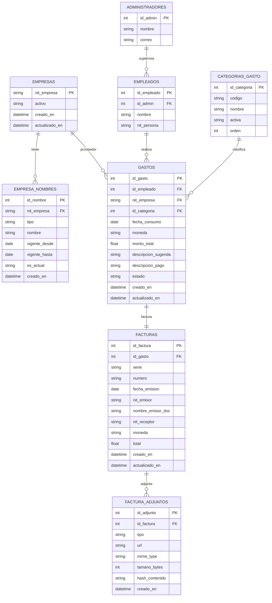

```mermaid
erDiagram
  ADMINISTRADORES ||--o{ EMPLEADOS : supervisa
  EMPRESAS ||--o{ EMPRESA_NOMBRES : tiene
  EMPRESAS ||--o{ GASTOS : proveedor
  EMPLEADOS ||--o{ GASTOS : realiza
  CATEGORIAS_GASTO ||--o{ GASTOS : clasifica
  GASTOS ||--|| FACTURAS : factura
  FACTURAS ||--o{ FACTURA_ADJUNTOS : adjunta

  ADMINISTRADORES {
    int id_admin PK
    string nombre
    string correo
  }

  EMPLEADOS {
    int id_empleado PK
    int id_admin FK
    string nombre
    string nit_persona
  }

  EMPRESAS {
    string nit_empresa PK
    string activo
    datetime creado_en
    datetime actualizado_en
  }

  EMPRESA_NOMBRES {
    int id_nombre PK
    string nit_empresa FK
    string tipo
    string nombre
    date vigente_desde
    date vigente_hasta
    string es_actual
    datetime creado_en
  }

  CATEGORIAS_GASTO {
    int id_categoria PK
    string codigo
    string nombre
    string activa
    int orden
  }

  GASTOS {
    int id_gasto PK
    int id_empleado FK
    string nit_empresa FK
    int id_categoria FK
    date fecha_consumo
    string moneda
    float monto_total
    string descripcion_sugerida
    string descripcion_pago
    string estado
    datetime creado_en
    datetime actualizado_en
  }

  FACTURAS {
    int id_factura PK
    int id_gasto FK
    string serie
    string numero
    date fecha_emision
    string nit_emisor
    string nombre_emisor_doc
    string nit_receptor
    string moneda
    float total
    datetime creado_en
    datetime actualizado_en
  }

  FACTURA_ADJUNTOS {
    int id_adjunto PK
    int id_factura FK
    string tipo
    string url
    string mime_type
    int tamano_bytes
    string hash_contenido
    datetime creado_en
  }

```
